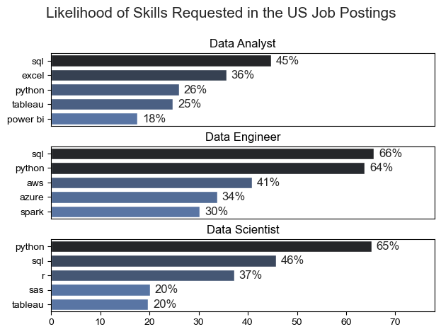
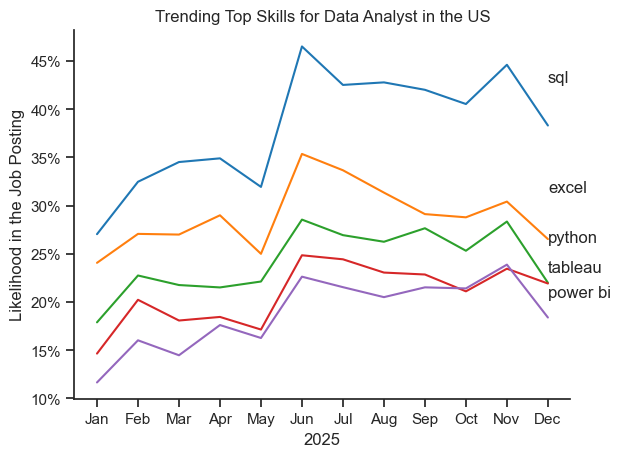
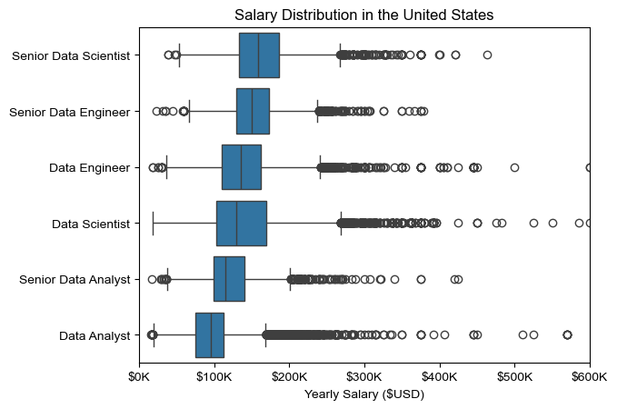
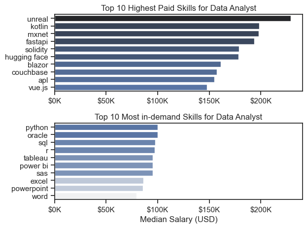
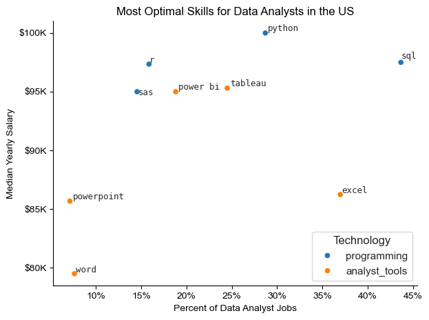

# 📊 Data Analyst Skills & Salary Analysis (US Job Market) 2025

# INTRODUCTION

The data job market is constantly evolving, and knowing which skills are truly valuable can make a significant difference in career decisions. This project analyzes U.S. job postings to uncover which skills are most demanded, how those skills trend over time, how they are compensated, and ultimately, which skills provide the best return on investment for Data Analysts.

# BACKGROUND

Data roles such as Data Analyst, Data Engineer, and Data Scientist often overlap, yet each requires a different combination of tools and technical expertise. Many aspiring analysts focus on learning popular tools without understanding how demand, salary, and specialization interact. This project aims to bridge that gap by using real job market data to provide actionable, data-driven insights.

# TOOLS USED

* Python – data analysis and visualization

* Pandas & NumPy – data manipulation

* Matplotlib & Seaborn – data visualization

* AdjustText – label optimization in scatter plots

* Jupyter Notebook – exploratory analysis and documentation

# ANALYSIS

The analysis is divided into four key questions:

* Most demanded skills across top data roles
Identifies core and role-specific skills for Data Analysts, Data Engineers, and Data Scientists.

* Skill demand trends for Data Analysts
Examines how in-demand skills evolve throughout the year to detect stability or change.

* Salary analysis by role and skill
Compares job salaries and evaluates the gap between high-demand and high-paying skills.

* Optimal skills for Data Analysts
Combines demand and salary metrics to determine which skills offer the highest overall career value.

Each section is supported by Python-based visualizations and detailed notebooks.

## 1. What are the most demanded skills for the top 3 most popular data roles? 

The data job market is highly competitive, and understanding which skills are most in demand is essential for making informed career decisions. In this section, we analyze job posting data using Python to identify the most requested skills for Data Analysts, Data Engineers, and Data Scientists. The following analysis reveals key patterns and differences across roles, providing valuable insights into current market expectations.

### Visualize Data

View my notebook with detailed steps here: 
[2_skill_count.ipynb](3_Proyect\2_skill_count.ipynb)

````python
fig, ax = plt.subplots(len(job_titles),1)

sns.set_theme(style='ticks')

for i, job_title in enumerate(job_titles):
    df_plot= df_skills_perc[df_skills_perc['job_title_short'] == job_title].head(5)
    sns.barplot(data=df_plot, x='skill_percent',y='job_skills', ax=ax[i],hue='skill_count',palette='dark:b_r')
    ax[i].set_title(job_title)
    ax[i].set_xlabel('')
    ax[i].set_ylabel('')
    ax[i].legend().remove()
    ax[i].set_xlim(0,78)

    for n, v in enumerate(df_plot['skill_percent']):   # add data labels ejemplo %
        ax[i].text(v + 1,n, f'{v:.0f}%', va='center')
    
    if i !=len(job_titles) -1:  #keep x axis ticks only in the last plot
        ax[i].set_xticks([]) #remuve x axis ticks

fig.suptitle('Likelihood of Skills Requested in the US Job Postings', fontsize=15)
fig.tight_layout(h_pad=0.5)
plt.show()
````
### Results



*Note: Percentages represent the share of U.S. job postings that explicitly mention each skill for the respective role. Only the top five most frequently requested skills per role are shown to highlight core market requirements.


### Insights

* SQL is a core skill across all roles, with highest demand for Data Engineers (66%) and strong relevance for Data Analysts (45%) and Data Scientists (46%).

* Python dominates advanced data roles, leading demand for both Data Engineers (64%) and Data Scientists (65%).

* Data Analysts show a more tool-oriented skill mix, relying on SQL, Excel (36%), and visualization tools like Tableau and Power BI.

* Cloud and big data tools are critical for Data Engineers, with AWS (41%), Azure (34%), and Spark (30%) appearing prominently.

* Data Scientists require statistical depth, reflected in continued demand for R (37%).

* Visualization tools have lower priority for advanced roles, indicating specialization as roles become more technical.

* Overall insight: skill requirements become more specialized and technical as roles progress from Data Analyst to Data Engineer and Data Scientist.

Role specialization is clear:

* Analysts → SQL, Excel, Tableau
* Engineers → SQL, Python, Cloud, Spark
* Scientists → Python, SQL, R


## 2. How are in-demand skills trending for Data Analysts?  

Beyond identifying the most demanded skills, it is equally important to understand how these skills evolve over time. In this section, we analyze trends in Data Analyst skill demand using Python to observe patterns, fluctuations, and potential shifts throughout the year. This time-based analysis helps uncover which skills remain stable and which show signs of growing or declining relevance.

### Visualize Data

View my notebook with detailed steps here: 
[3_skill_trend.ipynb](3_Proyect\3_skills_trend.ipynb)

````python
from matplotlib.ticker import PercentFormatter
ax = plt.gca()
ax.yaxis.set_major_formatter(PercentFormatter(decimals=0))

plt.show()
````

### Results



*Note: This chart shows monthly trends in the likelihood that specific skills appear in U.S. Data Analyst job postings during 2024. Percentages reflect relative demand over time and highlight seasonal patterns and stability in core analytical skills.

### Insights

* SQL remains the most in-demand skill throughout the year, peaking mid-year before declining slightly toward December.

* Excel shows strong mid-year growth, followed by a gradual decrease in demand in the second half of the year.

* Python maintains steady demand, indicating its role as a stable, core technical skill for Data Analysts.

* Tableau and Power BI follow similar trends, with moderate demand and noticeable increases around mid-year 📊

* Mid-year (June–July) represents the highest overall demand across most skills, suggesting seasonal hiring patterns.

* Overall insight: core Data Analyst skills remain stable, with temporary mid-year spikes rather than long-term upward or downward trends.


## 3. How well do jobs and skills pay for Data Analysts?

### Highest Paid & Most Demanded Skills for Data 

Understanding which skills are in demand is only part of the picture—compensation plays a crucial role as well. In this section, we use Python to analyze salary data for Data Analysts, examining how pay varies across roles and specific skills. This analysis provides insight into which skills are not only popular but also offer higher earning potential.

### Visualize Data

View my notebook with detailed steps here: 
[3_salary_analysus.ipynb](3_Proyect\4_salary_analysis.ipynb)

````python

# Top 10 Highest Paid Skills for Data Analysts
sns.barplot(data=df_DA_top_pay,x='median',y=df_DA_top_pay.index,ax=ax[0], hue='median', palette='dark:b_r')

# Top 10 Most In-demand Skills for Data Analyst
sns.barplot(data= df_DA_skills, x='median', y=df_DA_skills.index, ax=ax[1], hue='median',palette = 'light:b')

plt.show()
````

### Results



*Note: This boxplot illustrates the distribution of annual salaries in the U.S. across data roles and seniority levels. Medians, interquartile ranges, and outliers highlight salary progression, variability, and the impact of seniority on compensation.



*Note: These charts compare the top 10 highest-paid skills with the top 10 most in-demand skills for Data Analysts in the U.S. Median salaries are shown to highlight the gap between market demand and compensation, emphasizing the trade-off between accessibility and specialization.

### Insights 

* Salary increases clearly with seniority, with senior roles earning substantially more than junior positions across all data careers 📈

* Senior Data Scientists and Senior Data Engineers lead in median salaries, reflecting advanced technical expertise and higher responsibility

* Data Analysts have the lowest median salaries, but still show wide variability depending on skills, experience, and company

* Salary distributions widen for more technical roles, indicating that specialization significantly impacts compensation

* The highest-paid skills are highly specialized and niche, often outside the traditional Data Analyst toolkit (e.g., advanced programming, cloud, blockchain) 💰

* There is a strong gap between skill demand and pay: widely requested skills offer stability but not top compensation

* Core Data Analyst tools (Python, SQL, Tableau, Power BI) provide solid, reliable salaries but are less differentiating

* Office tools (Word, PowerPoint, Excel) remain common requirements but deliver the lowest return on investment

* Overall insight: career growth and higher earnings are driven by a combination of seniority + specialization, not by demand alone

## 4. What is the most optimal skill to learn for Data Analyst?

With both demand and salary in mind, the final step is identifying which skills offer the best overall return for Data Analysts. In this section, we use Python to combine skill popularity and median salary data to determine the most optimal skills to learn. This analysis highlights skills that balance strong market demand with competitive pay, helping prioritize learning paths with the highest career impact.

### Visualize Data

View my notebook with detailed steps here: 
[5_optimal_skills.ipynb](3_Proyect\5_optimal_skills.ipynb)

````python
from adjustText import adjust_text

plt.scatter(df_DA_skills_high_demand['skill_percent'], df_DA_skills_high_demand['median_salary']) 
plt.show()

````

### Results



*Note: This scatter plot compares skill demand (percentage of Data Analyst job postings) with median annual salary in the U.S. Skills positioned toward the upper-right offer the most optimal balance between high demand and strong compensation, highlighting Python as the strongest overall skill investment.

### INSIGHTS

* Python offers the best balance between demand and salary, combining high market demand with the highest median pay among analyst skills 🚀

* SQL remains the most in-demand skill, but its salary premium is slightly lower than Python’s, positioning it as a core requirement rather than a differentiator

* Tableau and Power BI provide strong mid-range value, offering competitive salaries with moderate demand—ideal for business-focused Data Analysts 📊

* R and SAS show high salaries but lower demand, indicating valuable yet more specialized analytical skills

* Excel is highly demanded but lower paid, reinforcing its role as a foundational, entry-level skill

* Word and PowerPoint deliver the lowest ROI, with both low demand and low compensation

* Key takeaway: the most optimal skills are those that balance strong demand and competitive pay, with Python clearly leading this trade-off


# CONCLUSION

This project demonstrates that the most optimal skill to learn is not simply the most popular or the highest paid in isolation. Instead, skills that balance strong demand with competitive compensation provide the greatest career impact. For Data Analysts, Python clearly stands out as the most optimal skill, while SQL and Excel remain essential foundations. Strategic upskilling—combining core tools with specialized knowledge—offers the best path for long-term career growth in the data field.